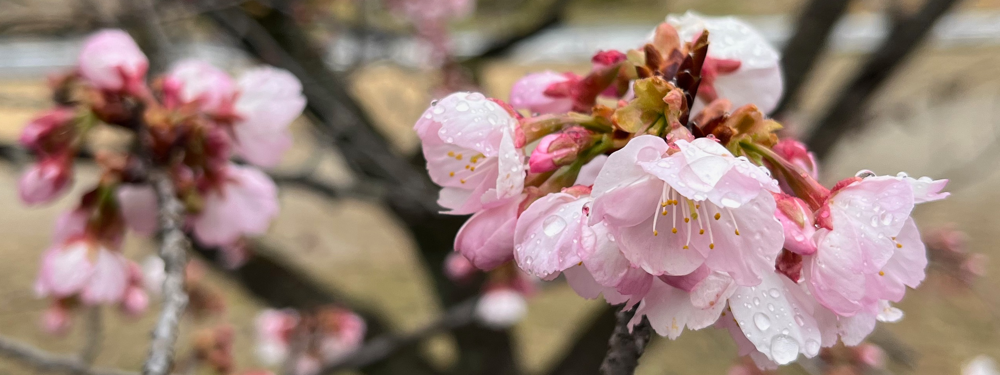

# Rainy Day Blog



This is a sample Rails app to create a blog whose title is "Rainy Day Blog."
In a calm rainy day, surrounding by soft sound of pouring rain,
people write a blog post -- this is an image of this app.

### Versions
- Ruby 3.2.3
- Rails 7.1.3.2
- PostgreSQL 15.6

### How to Run
```bash
$ rails db:create
$ rails db:migrate
$ rails s
```

### Run specs
```bash
$ bundle exec rspec
```
