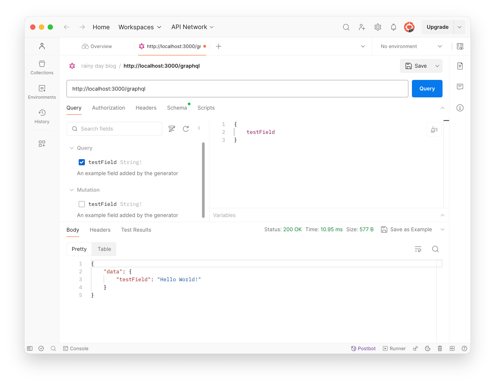

## Backend: GraphQL

This app provides GraphQL interface to a client to interact with the backend.

### Install GraphQL

To install GraphQL on Rails, two steps below should be done.
The first one installs graphql gem, while the second one generates boilerplate code for the GraphQL.

```bash
$ bundle add graphql
$ rails g graphql:install
```

Once the installation is finished below files will be created.
```bash
app/controllers/
├── application_controller.rb
├── concerns
├── graphql_controller.rb     # <-- newly generated controller
├── home_controller.rb
├── oauth_controller.rb
└── pkce_controller.rb

app/graphql
├── mutations
│   └── base_mutation.rb
├── rainy_day_blog_schema.rb
├── resolvers
│   └── base_resolver.rb
└── types
    ├── base_argument.rb
    ├── base_connection.rb
    ├── base_edge.rb
    ├── base_enum.rb
    ├── base_field.rb
    ├── base_input_object.rb
    ├── base_interface.rb
    ├── base_object.rb
    ├── base_scalar.rb
    ├── base_union.rb
    ├── mutation_type.rb
    ├── node_type.rb
    └── query_type.rb
```

The `config/routes.rb` is also updated as in below:

```ruby
Rails.application.routes.draw do
  if Rails.env.development?
    mount GraphiQL::Rails::Engine, at: "/graphiql", graphql_path: "/graphql"
  end
  post "/graphql", to: "graphql#execute"
  #...
end
```

The graphql installation adds a route to GraphiQL (GraphQL client) and a graphiql-rails in Gemfile.
But the graphiql-rails gem is not installed yet.
Run `bundle install` again to install `graphiql-rails`.


### Update CSRF setting

The GraphQL is an API, so it doesn't need a CSRF protection in general.
If the Rails app is created with `--api` option, CSRF setting is not there by default.
The API only Rails app doesn't need to take care of the CSRF protection.

However, if the Rails app is created with views like a typical Rails app, the CSRF protection is enabled.
GraphQL client such as [Insomnia](https://insomnia.rest/) or [Postman](https://www.postman.com/)
doesn't send back a CSRF token by default.
For an ease of development process, the CSRF protection is better to be disabled.

To disable the CSRF protection, add `skip_forgery_protection` to the controller.

```ruby
class GraphqlController < ApplicationController
  skip_forgery_protection
  #...
  #...
end
```

### Test if GraphQL works

The graphql installations creates a simple GraphQL endpoint.
The app is ready to answer the GraphQL query.
Open the GraphQL client (Postman), and make a query.

```graphql
{
  testField
}
```

If the query returns the result below, all are set up correctly.

```graphql
{
    "data": {
        "testField": "Hello World!"
    }
}
```




### References
- [GraphQL Ruby](https://graphql-ruby.org/)
- [ActionController::RequestForgeryProtection::ClassMethods](https://api.rubyonrails.org/classes/ActionController/RequestForgeryProtection/ClassMethods.html)
